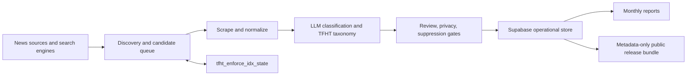

# TFHT Enforcement Index

[](https://github.com/DataHackIL/tfht_enforce_idx/actions/workflows/ci-test.yml)
[](LICENSE)
[](pyproject.toml)

News discovery, review, and public-release automation for the TFHT Enforcement Index
(`denbust`), a public-interest data project supporting the Task Force on Human Trafficking
and Prostitution.

Created by [Shay Palachy Affek](http://www.shaypalachy.com/).

## What This Is

The Enforcement Index monitors Israeli news and source material for enforcement activity related to
human trafficking, prostitution, brothels, pimping, exploitation, and adjacent legal action. The
repository contains the `denbust` Python package, operator configs, GitHub Actions workflows,
review tools, and release tooling used to turn incoming source material into structured,
review-gated `news_items` data.

The public-facing name is **TFHT Enforcement Index**. The package and CLI remain named `denbust` for
backward compatibility.

## Current Status

The primary implemented dataset is `news_items`. It supports:

- daily and weekly source discovery,
- candidate scraping and backfill,
- LLM-assisted relevance and taxonomy classification,
- human review and suppression gates,
- monthly report generation,
- metadata-only public release bundles,
- optional Kaggle, Hugging Face, Google Drive, and S3-compatible publication paths.

Additional dataset ideas such as `docs_metadata`, `open_docs_fulltext`, and `events` are planned
but not the current production surface.

## Architecture



Generated mutable state lives in the companion state repository,
[DataHackIL/tfht_enforce_idx_state](https://github.com/DataHackIL/tfht_enforce_idx_state). This
repository contains the code, workflows, schemas, and docs.

## Quick Start

Install the package for local development:

```bash
pip install -e ".[dev]"
python -m playwright install chromium
```

Run the local news ingest config:

```bash
denbust scan --config agents/news/local.yaml
```

Run discovery diagnostics:

```bash
denbust diagnose-discovery --config agents/news/local.yaml
```

Run the validation set lint:

```bash
denbust validation-lint --validation-set validation/news_items/classifier_validation.csv
```

Live runs require provider credentials and operational configuration. Keep secrets in local
environment files or GitHub Actions secrets; do not commit them.

## Common Operator Commands

```bash
denbust run --dataset news_items --job discover --config agents/news/local.yaml
denbust run --dataset news_items --job backfill_discover --config agents/news/local.yaml
denbust run --dataset news_items --job backfill_scrape --config agents/news/local.yaml
denbust run --dataset news_items --job ingest --config agents/news/local.yaml
denbust report monthly --month 2026-03 --config agents/news/local.yaml
denbust release --dataset news_items --config agents/release/news_items.yaml
denbust backup --dataset news_items --config agents/backup/news_items.yaml
```

## Persistence Modes

Local runs default to repo-local state under `data/`. You can override the local state layout with:

- `DENBUST_STATE_ROOT`
- `DENBUST_STORE_PATH`
- `DENBUST_RUNS_DIR`

GitHub Actions runs check out the companion state repo and write namespaced state under
`news_items/<job>/`. The important production jobs are:

- `news_items / discover`
- `news_items / ingest`
- `news_items / backfill_discover`
- `news_items / backfill_scrape`
- `news_items / monthly_report`
- `news_items / release`
- `news_items / backup`

For the detailed state layout and runbook, see
[docs/discovery_operations.md](docs/discovery_operations.md).

## Repository Map

| Path | Purpose |
|---|---|
| `src/denbust/` | Python package and CLI implementation |
| `agents/` | Local and GitHub Actions job configs |
| `.github/workflows/` | Scheduled and manual operational workflows |
| `supabase/migrations/` | Operational database schema |
| `review_app/` | Candidate and news-item review workbench |
| `ingest_app/` | Manual ingest workbench |
| `validation/` | Classifier validation data |
| `docs/` | Product definition, operations docs, plans, and evidence reports |

## Deeper Documentation

- [Product definition](docs/product_def.md)
- [Discovery operations runbook](docs/discovery_operations.md)
- [Review workbench reference](docs/ops/review-workbench.md)
- [Labeling semantics](docs/ops/labeling-semantics.md)
- [Detailed operational reference](docs/operational_reference.md)

## License

This repository is released under the [MIT License](LICENSE).

## Credits

Created by [Shay Palachy Affek](http://www.shaypalachy.com/) [GitHub](https://github.com/shaypal5)
